# 读写分离后为什么会读到旧数据：MaxScale 的一致性读

## 问题

读写分离最容易让人困惑的一幕是：写请求已经返回成功，紧接着发起查询，却没有看到刚写入的数据。这里不一定是事务没有提交，而是写落在主库后，读被路由到了尚未追上复制进度的副本。

那么，有什么办法可以解决这个问题呢？那就是本文要分析的 MaxScale，它解决了这个问题。

## MaxScale 的解决方案

MaxScale 的一致性读思路是把“这次写已经产生到哪里”的 GTID 获取到，再让之后的读请求以这个位置为边界：要么等待只读节点追上，要么直接选择已经追上的只读节点。

源码中将因果读(就是一致性读，不同叫法)分为 `NONE`、`LOCAL`、`GLOBAL` 和 `FAST` 四种策略。它们解决问题的力度和代价并不相同。

### NONE：不施加一致性约束

`NONE` 不为读请求附加 GTID 条件。读写分离仍可照常路由，但一次写之后的下一次读可能落到复制尚未完成的副本，因此可能看到旧数据。这是没有因果读保障时最直接的行为。

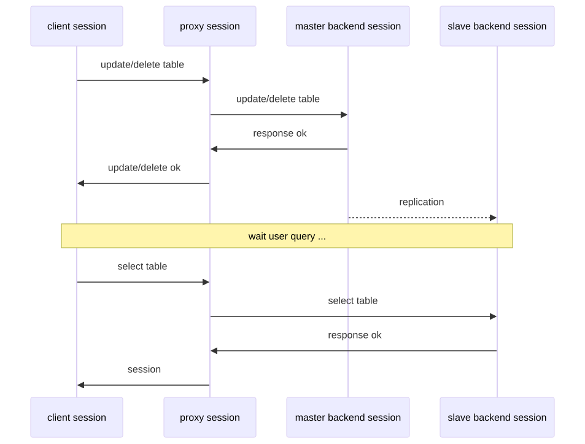

### LOCAL：只保证同一会话的前后关系

`LOCAL` 关注同一个 proxy session 内的读写顺序。写请求完成后得到的 GTID 保存在该 session 中；后续由同一 session 发起的读，会以这个 GTID 作为“至少已经执行到这里”的条件。

它的边界也很清楚：新建连接或换到另一个 session，并不会自动继承前一个 session 记录的位置。

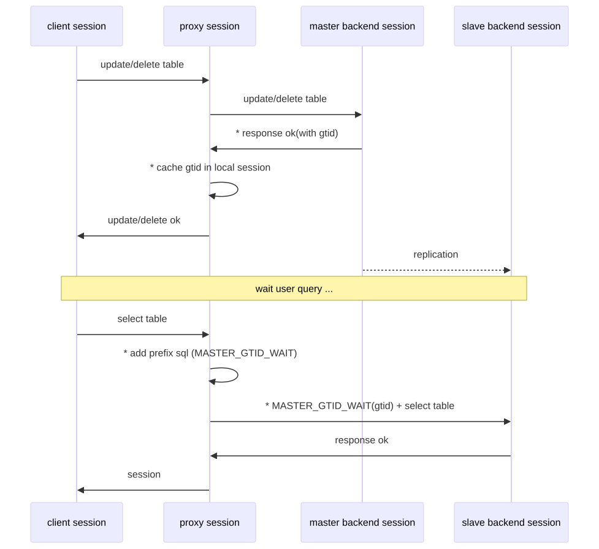

### GLOBAL：把位置扩大到代理全局范围

`GLOBAL` 将写请求得到的 GTID 保存到 proxy 的全局状态中，而不只属于单个 session。这样，不同 session 的读请求也能以同一份进度为依据，减少“换一个连接又读旧了”的情况。

相应地，它的等待范围更大：一个会话产生的写进度会影响其他会话后续读请求的选择或等待。

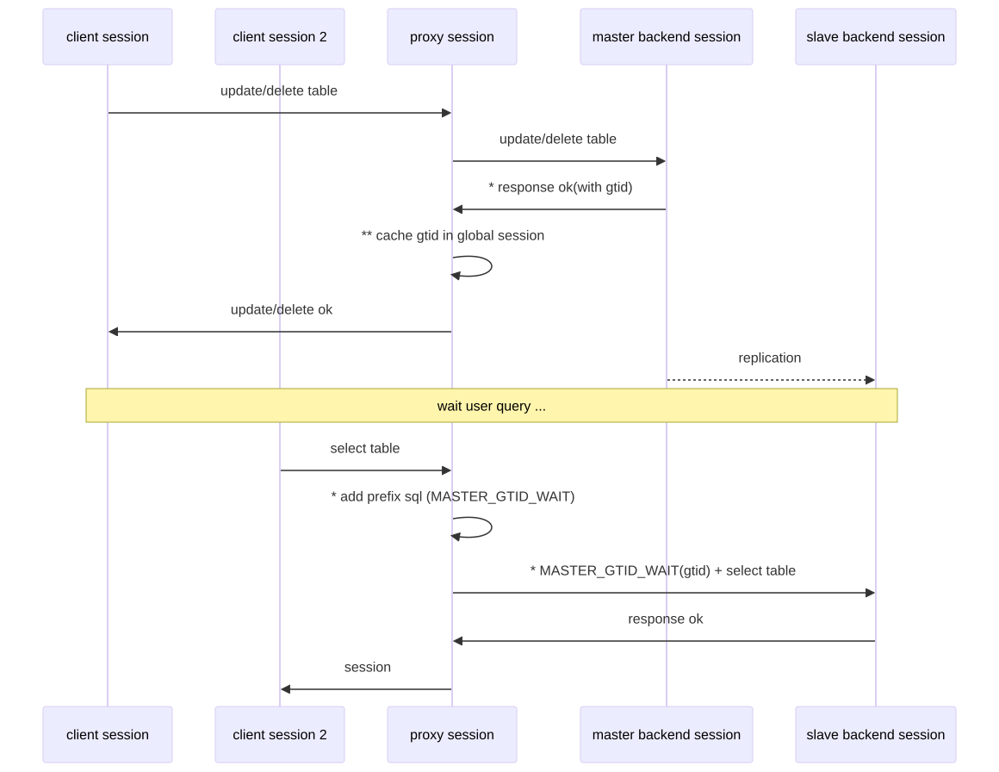

### FAST：优先选择已经追上的后端

`FAST` 不把重点放在读前等待，而是查看多个后端已知的 GTID 位置，挑选一个已经满足目标 GTID 的节点来处理读请求。若存在这样的副本，读可以直接发送过去，避免为了等待复制进度而阻塞在读路径上。

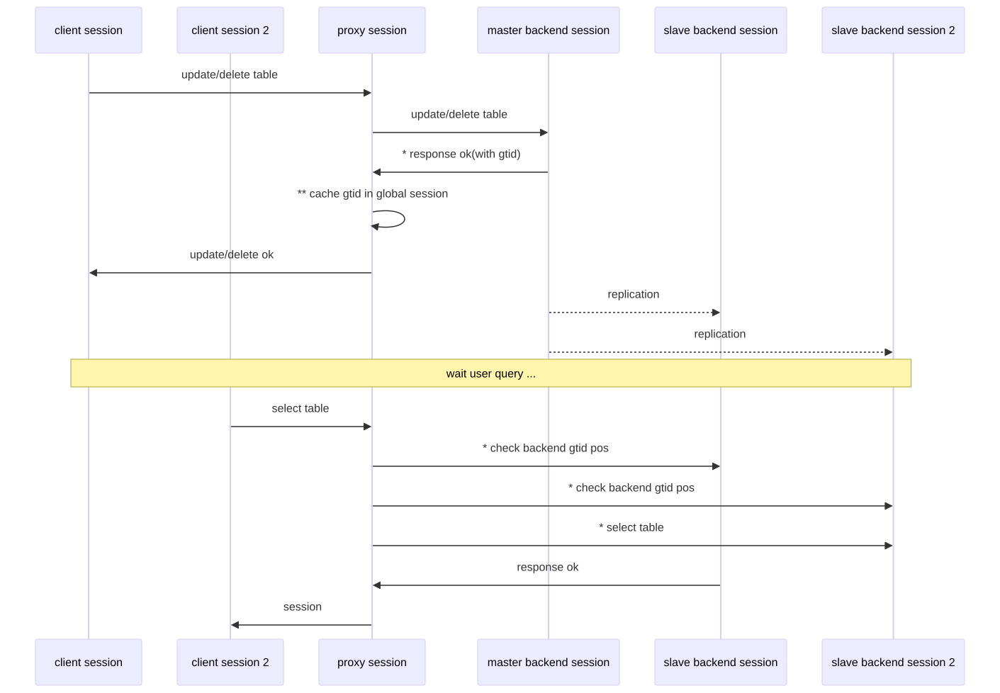

## MaxScale 的一致性读实现

### proxy 在主节点写入时同步获取GTID

要让代理知道“一次成功的写对应哪个位置”，后端 server 必须在写完成后的 response 中返回 GTID。不同服务端的会话跟踪配置和返回方式并不完全一样：
- MariaDB 通过 `session_track_system_variables` 参数
- MySQL 使用 `session_track_gtids` 参数

| 数据库类型          | 参数说明                                                              |
| -------------- | ----------------------------------------------------------------- |
| MySQL 会话跟踪参数   | 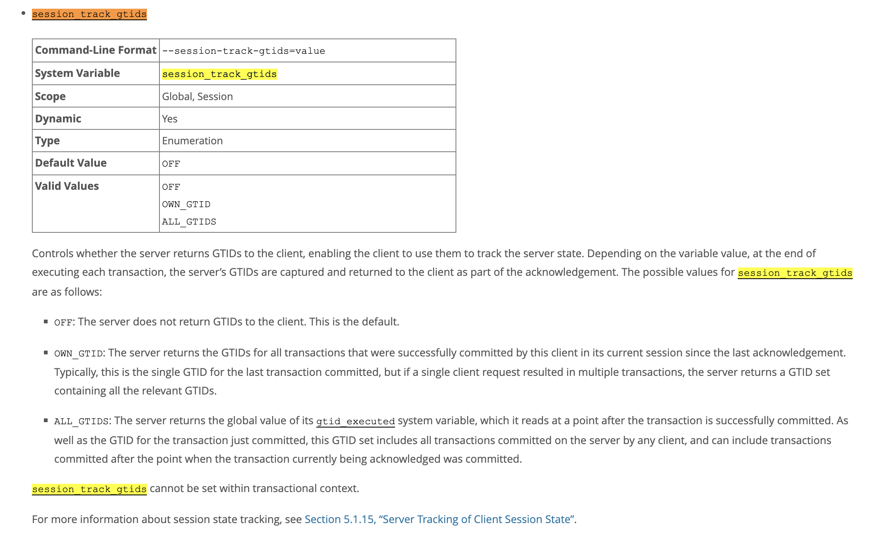                                         |
| MariaDB 会话跟踪参数 | 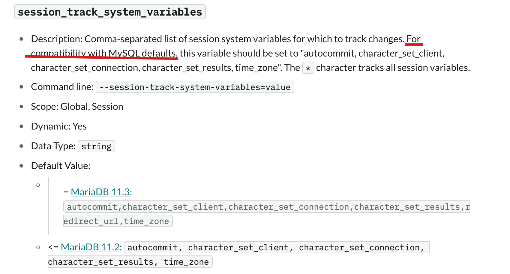  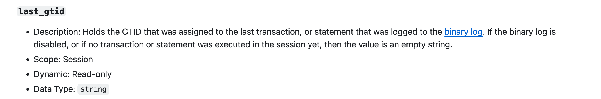  |
### proxy 解析 response 中的 GTID

MaxScale 会依据 response 中的协议标志和内容解析 GTID。

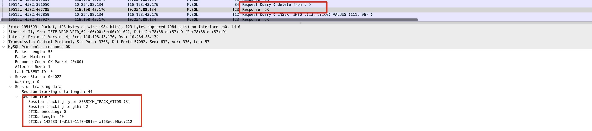
（上图为MySQL的抓包结果）

MariaDB 与 MySQL 的返回标识并不相同，因此代理需要按各自的 response 形式识别并提取位置。

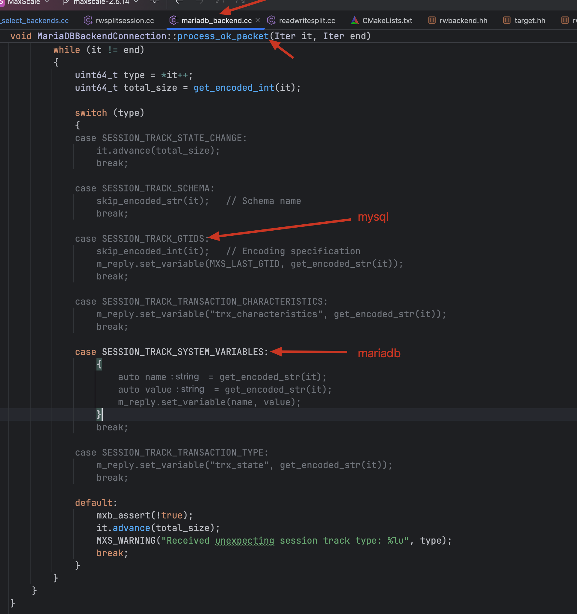

提取成功后，GTID 才能写入 session 状态或全局状态，供读请求使用。

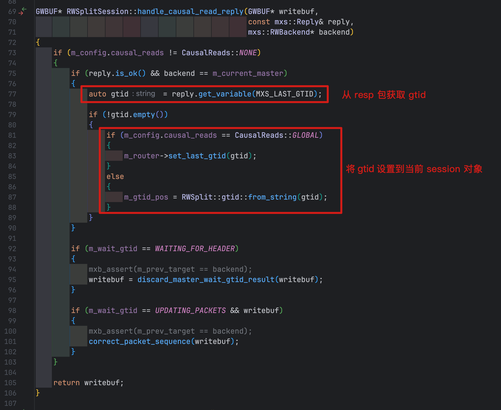

### proxy 在只读节点读取时使用GTID

读请求进入代理时，代理先取得当前需要满足的 GTID。
- 对 `LOCAL` 而言，这通常来自当前 session 已记录的写进度；
- 对 `GLOBAL` 而言，则来自代理维护的全局进度。

此时关键问题从“要不要读副本”变成了“这个后端是否已经包含目标位置”。

### LOCAL 与 GLOBAL：用 GTID_WAIT 建立等待边界

在 `LOCAL` 和 `GLOBAL` 策略下，代理会在实际读请求前加入一个GTID等待SQL。
MariaDB 用 MASTER_GTID_WAIT、 MySQL 用 WAIT_FOR_EXECUTED_GTID_SET 。
等待成功时，读请求才继续；超时、错误会在主库上读取。
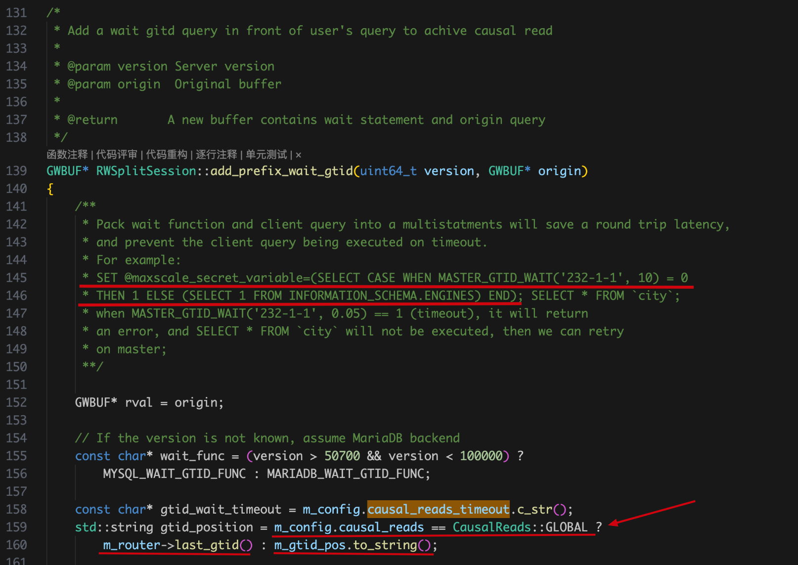
这也说明了一致性不是凭空得到的。选择等待可以降低读到旧数据的概率，但复制延迟会转化为读请求的额外等待时间。

### FAST：比较进度，选择合适的后端

它比较目标 GTID 与后端节点的已知GTID位置，优先把读请求送往已经满足该位置的 server。其核心是“选一个已经追上的节点”，而非先把读请求提交给某个节点再等待。

（问题来了，这就需要不断维护所有后端节点的GTID，那这个是怎么获取和维护的？我们日后文章再说）

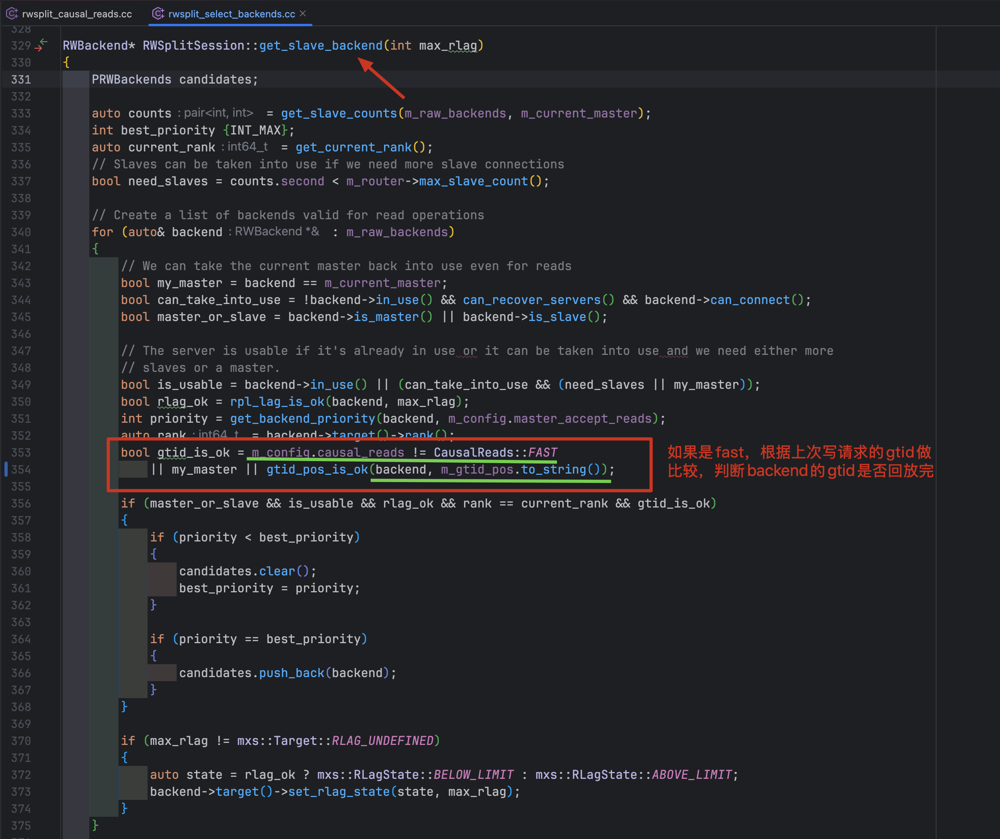

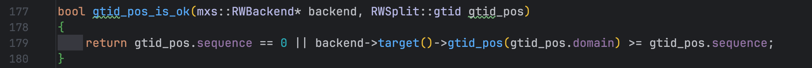

## 总结

通过以上，我们可以看出MaxScale实现的非常巧妙，逻辑也很清晰。不过因为MariaDB和MySQL两个分支，在 GTID格式、会话跟踪参数、GTID_WAIT 等地方存在差异，需要区分处理。
